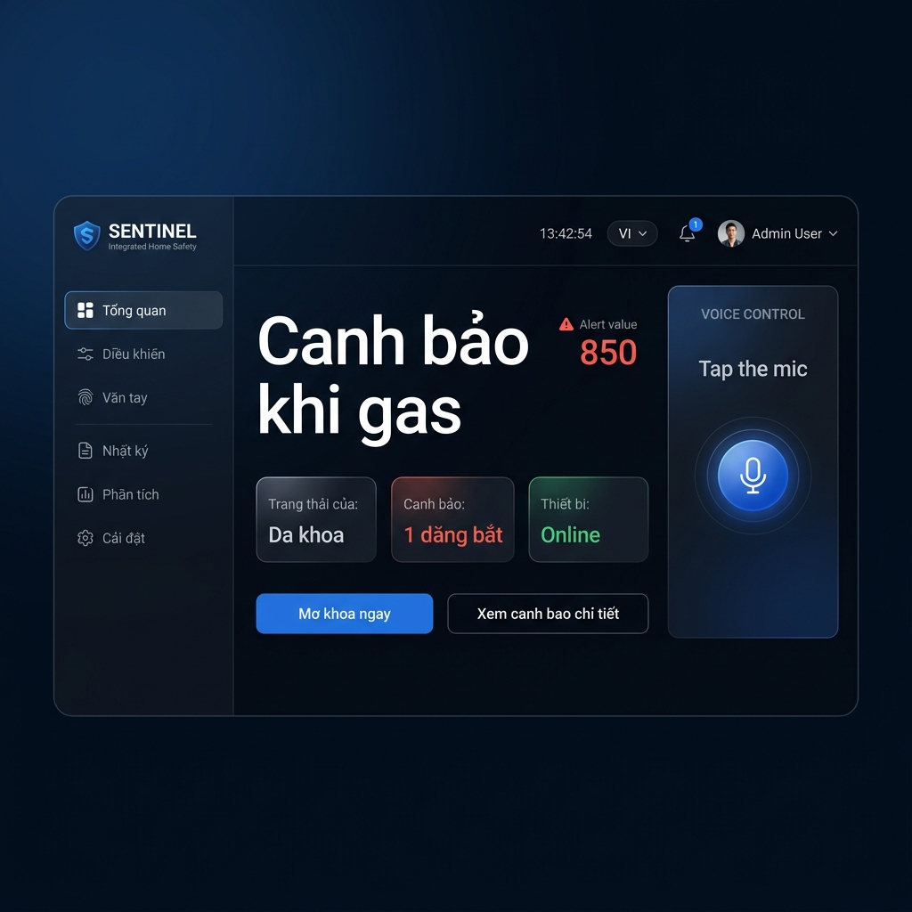

# Integrated Home Safety System V2

[](https://openjdk.org/)
[](https://spring.io/projects/spring-boot)
[](https://react.dev/)
[](https://vite.dev/)
[](https://nextjs.org/)
[](#license)

A full-stack IoT smart lock and home safety platform that combines **ESP32 sensor hardware**, a **Spring Boot backend**, and a **React dashboard** to deliver centralized access control, real-time environmental monitoring, fingerprint management, and intelligent alert workflows — all accessible from a single web interface.

> **Workspace note:**
> This repository contains two frontend workspaces:
> - `src/` (root) — the **active** Vite + React dashboard powering the smart lock UI.
> - `frontend/` — a separate Next.js workspace (starter state, not actively used).
>
> Use the root Vite app for all dashboard development.

## Demo / Screenshot



## Table of Contents

- [Overview](#overview)
- [Core Features](#core-features)
- [Architecture](#architecture)
- [Tech Stack](#tech-stack)
- [Project Structure](#project-structure)
- [System Requirements](#system-requirements)
- [Installation](#installation)
- [Environment Variables](#environment-variables)
- [Run Locally](#run-locally)
- [Run with Docker](#run-with-docker)
- [Testing](#testing)
- [Build for Production](#build-for-production)
- [API Reference](#api-reference)
- [WebSocket Topics](#websocket-topics)
- [Blynk Virtual Pin Map](#blynk-virtual-pin-map)
- [Firmware (ESP32)](#firmware-esp32)
- [Database & Migrations](#database--migrations)
- [Security Model](#security-model)
- [Frontend Pages & Components](#frontend-pages--components)
- [Development Workflow](#development-workflow)
- [CI/CD Pipeline](#cicd-pipeline)
- [Deployment](#deployment)
- [Contributing](#contributing)
- [Roadmap](#roadmap)
- [FAQ](#faq)
- [Troubleshooting](#troubleshooting)
- [License](#license)

---

## Overview

This platform solves the problem of **fragmented home security** by unifying access control, environmental sensors, and alert management into one system.

The system is composed of three layers:

1. **Hardware layer** — ESP32 microcontroller reads MQ2 (gas), LDR (light), PIR (motion) sensors and pushes telemetry to both **Blynk Cloud** and the **Spring Boot backend** via HTTP POST.
2. **Backend layer** — Spring Boot REST API handles authentication (JWT), role-based access control (RBAC), device management, telemetry ingestion, alert generation, fingerprint enrollment, audit logging, analytics, and real-time WebSocket push.
3. **Frontend layer** — React 19 + Vite 8 single-page application provides a dashboard with live telemetry charts, remote lock control, fingerprint management, access logs, analytics, settings, and admin user management.

---

## Core Features

### Access & Authentication
- JWT-based authentication with `ADMIN`, `MEMBER`, `VIEWER` roles
- Step-up re-authentication (`/api/auth/re-auth`) for sensitive actions
- `X-Verification-Token` header required for lock toggle, fingerprint enroll/delete, settings changes
- Session expiry detection with automatic redirect to login

### Device & Lock Control
- Remote door lock/unlock via Blynk virtual pin commands
- Device online status monitoring
- Per-device settings (gas threshold, alert enable, etc.)

### Fingerprint Management
- Enroll new fingerprints with auto-slot allocation
- Delete and rename fingerprints
- Access level normalization: `ADMIN`, `STANDARD`, `GUEST`
- Commands pushed to ESP32 via Blynk pins (V100–V104)

### Telemetry & Sensors
- Real-time ingestion from ESP32: gas (MQ2), light (LDR), motion (PIR), temperature
- WebSocket push to dashboard via STOMP over SockJS
- Historical sensor data storage

### Alerts & Notifications
- Alert types: `GAS_LEAK`, `FIRE_ALARM`, `INTRUDER_ALERT`, `WRONG_PASSWORD`, `TAMPER_ALERT`, `BATTERY_LOW`, `OFFLINE_ALERT`
- Alert resolution workflow with verification
- CSV export for alerts and access logs
- Real-time alert push via WebSocket

### Analytics & Audit
- Analytics snapshots and weekly reports per device
- Full access log with method tracking: `PASSWORD`, `FINGERPRINT`, `RFID`, `REMOTE`, `PHYSICAL_KEY`
- Admin user management: toggle active, change roles

### Dashboard UX
- 3D house visualization (Three.js)
- Dark/light theme toggle
- Multi-language support (Vietnamese/English)
- Voice command integration
- Floating mic widget, animated cursor effects
- Profile management with avatar upload

---

## Architecture

```text
┌─────────────────┐
│   ESP32 + Sensors│
│  (MQ2, LDR, PIR)│
└────────┬────────┘
         │ HTTP POST /api/telemetry/report
         │ Blynk Virtual Pins
         ▼
┌─────────────────────────────────────────────┐
│            Spring Boot Backend              │
│                                             │
│  ┌─────────┐ ┌──────────┐ ┌──────────────┐ │
│  │   Auth   │ │  Device  │ │  Fingerprint │ │
│  │  (JWT)   │ │  Control │ │  Management  │ │
│  └─────────┘ └──────────┘ └──────────────┘ │
│  ┌─────────┐ ┌──────────┐ ┌──────────────┐ │
│  │ Alerts  │ │Analytics │ │  Telemetry   │ │
│  └─────────┘ └──────────┘ └──────────────┘ │
│  ┌─────────┐ ┌──────────┐ ┌──────────────┐ │
│  │  Audit  │ │ Settings │ │    Admin     │ │
│  └─────────┘ └──────────┘ └──────────────┘ │
│                                             │
│  Database: H2 (dev) / PostgreSQL (prod)     │
│  Migrations: Flyway (V1–V11)               │
│  WebSocket: STOMP + SockJS (/ws-smart-lock) │
│  IoT Bridge: Blynk Cloud External API       │
└──────────────────┬──────────────────────────┘
                   │ REST API + WebSocket
                   ▼
┌─────────────────────────────────────────────┐
│         Vite + React Dashboard              │
│                                             │
│  Pages: Dashboard, Remote Control,          │
│  Fingerprints, Logs, Analytics,             │
│  Settings, User Management                  │
│                                             │
│  Real-time: STOMP subscription              │
│  3D: Three.js house model                   │
│  i18n: Vietnamese / English                 │
└─────────────────────────────────────────────┘
```

---

## Tech Stack

| Layer | Technology | Version |
| --- | --- | --- |
| **Frontend (active)** | React, Vite, React Router, Tailwind CSS, Three.js, STOMP.js, SockJS | React 19, Vite 8 |
| **Frontend (secondary)** | Next.js, React, TypeScript, Tailwind CSS | Next.js 16 |
| **Backend** | Spring Boot, Spring Security, Spring Data JPA, Spring WebSocket, Lombok | Spring Boot 3.2.4, Java 17 |
| **Authentication** | JWT (jjwt 0.11.5) | — |
| **Database** | H2 (dev), PostgreSQL (prod) | — |
| **Migrations** | Flyway | — |
| **API Docs** | springdoc-openapi (Swagger UI) | 2.5.0 |
| **IoT Platform** | Blynk Cloud External API | — |
| **Firmware** | ESP32 Arduino (WiFi, HTTPClient, ArduinoJson, BlynkSimpleEsp32) | — |
| **DevOps** | Docker, GitHub Actions, Vercel, Render | — |

---

## Project Structure

```text
Integrated-Home-Safety-System-V2/
├─ .github/workflows/
│  ├─ ci.yml                    # CI: build backend + lint/build frontend
│  └─ cd.yml                    # CD: Render deploy hook + Vercel info
├─ backend/
│  ├─ Dockerfile                # Multi-stage build (Maven → JRE Alpine)
│  ├─ pom.xml
│  └─ src/main/java/com/smartlock/
│     ├─ config/                # Security, WebSocket, OpenAPI, JWT filter
│     ├─ controller/            # 11 REST controllers
│     ├─ dto/                   # Request/response DTOs
│     ├─ model/                 # 13 JPA entities + 6 enums
│     ├─ repository/            # 13 Spring Data repositories
│     ├─ service/               # 16 service classes
│     └─ common/                # Shared utilities (VerificationService)
├─ firmware/
│  ├─ ESP32_Backend_Telemetry_Test.ino   # Full sensor → backend test sketch
│  └─ ESP32_Telemetry_Patch.ino          # Patch for existing firmware
├─ frontend/                    # Secondary Next.js workspace (starter)
├─ src/                         # Active Vite + React dashboard
│  ├─ components/               # 13 UI components
│  ├─ contexts/                 # 6 React contexts (Auth, Theme, Lang, etc.)
│  ├─ pages/                    # 9 page components
│  ├─ services/                 # API client + WebSocket realtime service
│  ├─ utils/                    # Utility functions
│  ├─ App.jsx                   # Router + provider tree
│  └─ index.css                 # Global styles + Tailwind
├─ public/                      # Static assets (favicon, preview image)
├─ docker-compose.yml
├─ package.json                 # Root Vite app dependencies
├─ vite.config.js               # Dev server (port 3000) + API proxy
├─ vercel.json                  # Vercel deployment config
└─ README.md
```

---

## System Requirements

- **Node.js** >= 20
- **npm** >= 10
- **Java** 17
- **Maven** >= 3.9
- **Docker** & Docker Compose (optional)
- **PostgreSQL** (optional, for production profile)
- **ESP32** hardware + Blynk account (optional, for live device integration)

---

## Installation

### 1. Clone the repository

```bash
git clone https://github.com/harry-leon/Integrated-Home-Safety-System-V2.git
cd Integrated-Home-Safety-System-V2
```

### 2. Install frontend dependencies

```bash
npm install
```

### 3. Build backend

```bash
cd backend
mvn clean package -DskipTests
cd ..
```

---

## Environment Variables

### Root `.env`

```env
PROJECT_NAME=smart-lock-system
BACKEND_PORT=8080
FRONTEND_PORT=3000
VITE_API_BASE_URL=http://localhost:8080
```

> `VITE_API_BASE_URL` is optional for local dev — `vite.config.js` proxies `/api` to `localhost:8080` automatically.

### Backend (`application.yml`)

Local dev uses H2 by default. For production, set:

```env
SPRING_PROFILES_ACTIVE=prod
SPRING_DATASOURCE_URL=jdbc:postgresql://localhost:5432/smartlock
SPRING_DATASOURCE_USERNAME=your_db_user
SPRING_DATASOURCE_PASSWORD=your_db_password
JWT_SECRET_KEY=replace_with_a_secure_secret
JWT_EXPIRATION=86400000
```

> ⚠️ The `blynk.auth-token` is currently in `application.yml`. Move it to environment variables before production deployment.

---

## Run Locally

### Backend

```bash
cd backend
mvn spring-boot:run
```

| URL | Purpose |
| --- | --- |
| `http://localhost:8080` | API base |
| `http://localhost:8080/h2-console` | H2 database console |
| `http://localhost:8080/swagger-ui/index.html` | Swagger UI |

### Frontend Dashboard

```bash
npm run dev
```

Dashboard: `http://localhost:3000`

---

## Run with Docker

### Backend only

```bash
docker build -t smart-lock-backend ./backend
docker run --rm -p 8080:8080 smart-lock-backend
```

### Docker Compose

```bash
docker compose up --build
```

> ⚠️ The `frontend/` service in `docker-compose.yml` requires a Dockerfile that doesn't exist yet. Use Docker for backend only, or update the compose file to build the root Vite app.

---

## Testing

### Backend

```bash
cd backend
mvn test
```

> **Known issue:** `V4__add_user_profile_and_login_sessions.sql` uses `gen_random_uuid()` which is not available in H2.

### Frontend build verification

```bash
npm run build
```

---

## Build for Production

| Target | Command | Output |
| --- | --- | --- |
| Frontend | `npm run build` | `dist/` |
| Backend | `cd backend && mvn clean package -DskipTests` | `backend/target/*.jar` |

---

## API Reference

### Authentication

| Method | Endpoint | Auth | Description |
| --- | --- | --- | --- |
| `POST` | `/api/auth/login` | Public | Login, returns JWT |
| `POST` | `/api/auth/register` | Public | Register new account |
| `POST` | `/api/auth/re-auth` | JWT | Step-up verification, returns verification token |
| `POST` | `/api/auth/logout` | JWT | Logout |

### Devices

| Method | Endpoint | Auth | Description |
| --- | --- | --- | --- |
| `GET` | `/api/devices` | JWT | List accessible devices |
| `POST` | `/api/devices/{id}/lock/toggle` | JWT + Verify | Toggle door lock |

### Fingerprints

| Method | Endpoint | Auth | Description |
| --- | --- | --- | --- |
| `GET` | `/api/fingerprints?deviceId=` | JWT | List fingerprints |
| `POST` | `/api/fingerprints/enroll` | ADMIN + Verify | Enroll new fingerprint |
| `DELETE` | `/api/fingerprints/{id}` | ADMIN + Verify | Delete fingerprint |
| `PATCH` | `/api/fingerprints/{id}` | ADMIN | Rename fingerprint |

### Telemetry

| Method | Endpoint | Auth | Description |
| --- | --- | --- | --- |
| `POST` | `/api/telemetry/report` | Public | ESP32 sensor data ingestion |

### Alerts

| Method | Endpoint | Auth | Description |
| --- | --- | --- | --- |
| `GET` | `/api/alerts` | JWT | List alerts (paginated) |
| `POST` | `/api/alerts/{id}/resolve` | JWT + Verify | Resolve alert |
| `GET` | `/api/alerts/export` | JWT | Export alerts as CSV |

### Other Endpoints

| Group | Base Path | Description |
| --- | --- | --- |
| Access Logs | `/api/access-logs` | Audit log listing + CSV export |
| Analytics | `/api/analytics` | Snapshots + weekly reports |
| Settings | `/api/settings` | Device settings + notification settings |
| Profile | `/api/me` | Profile, avatar upload, login history |
| Admin | `/api/admin` | User list, sessions, role changes |
| Blynk | `/api/integration/blynk` | Webhook callbacks from Blynk/device |

### Example: Login

```bash
curl -X POST http://localhost:8080/api/auth/login \
  -H "Content-Type: application/json" \
  -d '{"email": "admin@smartlock.com", "password": "password"}'
```

### Example: Step-up verification flow

```bash
# 1. Re-authenticate to get verification token
curl -X POST http://localhost:8080/api/auth/re-auth \
  -H "Authorization: Bearer <access-token>" \
  -H "Content-Type: application/json" \
  -d '{"password": "password"}'

# 2. Use verification token for sensitive action
curl -X POST http://localhost:8080/api/devices/<device-id>/lock/toggle \
  -H "Authorization: Bearer <access-token>" \
  -H "X-Verification-Token: <verification-token>"
```

### Example: Enroll fingerprint

```bash
curl -X POST http://localhost:8080/api/fingerprints/enroll \
  -H "Authorization: Bearer <access-token>" \
  -H "X-Verification-Token: <verification-token>" \
  -H "Content-Type: application/json" \
  -d '{
    "deviceId": "<device-uuid>",
    "personName": "Nguyen Van A",
    "accessLevel": "STANDARD",
    "note": "Front door access"
  }'
```

### Example: Submit telemetry from ESP32

```bash
curl -X POST http://localhost:8080/api/telemetry/report \
  -H "Content-Type: application/json" \
  -d '{
    "deviceCode": "SL-FRONT-001",
    "gasValue": 120,
    "ldrValue": 420,
    "pirTriggered": false,
    "temperature": 29.5,
    "weatherDesc": "clear sky"
  }'
```

---

## WebSocket Topics

The backend uses STOMP over SockJS at endpoint `/ws-smart-lock`.

| Topic | Payload | Description |
| --- | --- | --- |
| `/topic/devices/{deviceCode}/telemetry` | Sensor data JSON | Live telemetry for a specific device |
| `/topic/devices/{deviceCode}/alerts` | Alert JSON | Device-specific alerts |
| `/topic/alerts` | Alert JSON | Global alert broadcast |

---

## Blynk Virtual Pin Map

| Pin | Constant | Direction | Description |
| --- | --- | --- | --- |
| V1 | `PIN_GAS_VALUE` | ESP32 → Blynk | Gas sensor reading |
| V2 | `PIN_TEST_LED` | ESP32 → Blynk | Gas threshold LED |
| V3 | `PIN_LDR_VALUE` | ESP32 → Blynk | Light sensor reading |
| V4 | `PIN_PIR_VALUE` | ESP32 → Blynk | Motion detection |
| V20 | `PIN_DOOR_CONTROL` | Backend → Blynk | Door open/close command |
| V30 | `PIN_DOOR_STATUS` | Blynk → Backend | Door status feedback |
| V40 | `PIN_ALERT_ENABLE` | Backend → Blynk | Alert enable/disable |
| V50 | `PIN_TEMPERATURE` | ESP32 → Blynk | Temperature reading |
| V51 | `PIN_WEATHER_CONDITION` | ESP32 → Blynk | Weather description |
| V100 | `PIN_FINGER_ID` | Backend → Blynk | Finger slot ID for enroll/delete |
| V101 | `PIN_FINGERPRINT_REGISTER` | Backend → Blynk | Trigger fingerprint enrollment |
| V102 | `PIN_FINGERPRINT_DELETE` | Backend → Blynk | Trigger fingerprint deletion |
| V103 | `PIN_DISPLAY` | Backend → Blynk | Display message on device |
| V104 | `PIN_NAME` | Backend → Blynk | Person name for enrollment |

---

## Firmware (ESP32)

### Hardware Pins

| Pin | Sensor | Type |
| --- | --- | --- |
| GPIO 35 | MQ2 (Gas) | Analog |
| GPIO 34 | LDR (Light) | Analog |
| GPIO 27 | PIR (Motion) | Digital |

### Telemetry Flow

1. ESP32 reads sensors every 1 second
2. Values are written to Blynk virtual pins (V1–V4)
3. JSON payload is POSTed to `http://<backend-ip>:8080/api/telemetry/report`
4. Backend returns `202 Accepted`

### Configuration

Edit the firmware `.ino` file to set:

```cpp
#define BLYNK_TEMPLATE_ID   "YOUR_TEMPLATE_ID"
#define BLYNK_AUTH_TOKEN    "YOUR_BLYNK_AUTH_TOKEN"
char ssid[] = "YOUR_WIFI_SSID";
char pass[] = "YOUR_WIFI_PASSWORD";
const char* BACKEND_TELEMETRY_URL = "http://192.168.1.100:8080/api/telemetry/report";
```

---

## Database & Migrations

### Flyway Migrations (V1–V11)

| Version | Description |
| --- | --- |
| V1 | Initial schema (users, devices, alerts, access_logs, sensor_data, etc.) |
| V2 | Seed data (devices, admin user, sample data) |
| V3 | Add retry count to device commands |
| V4 | User profile and login sessions |
| V5 | Normalize user-device permissions |
| V6 | Seed authorization test accounts |
| V7 | Reset test account passwords |
| V8 | Ensure test account consistency |
| V9 | Fix incorrect role prefixes |
| V10 | Fix user role mappings |
| V11 | Normalize legacy enum values |

### Entity Models (13 entities)

`User`, `UserDetail`, `UserLoginSession`, `Device`, `DeviceCommand`, `DeviceSettings`, `SensorData`, `AccessLog`, `Alert`, `Fingerprint`, `NotificationSettings`, `UserDevice`, `WeeklyReport`

### Enums

- **UserRole:** `ADMIN`, `MEMBER`, `VIEWER`
- **AccessMethod:** `PASSWORD`, `FINGERPRINT`, `RFID`, `REMOTE`, `PHYSICAL_KEY`
- **AccessAction:** `ENROLLED`, `DELETED`, etc.
- **AlertType:** `GAS_LEAK`, `FIRE_ALARM`, `INTRUDER_ALERT`, `WRONG_PASSWORD`, `TAMPER_ALERT`, `BATTERY_LOW`, `OFFLINE_ALERT`
- **CommandStatus:** pending / completed states
- **UserDevicePermission:** device-level access grants

---

## Security Model

### Authentication Flow

```text
Client → POST /api/auth/login → JWT accessToken
Client → Bearer token in Authorization header → Authenticated requests
Client → POST /api/auth/re-auth → Verification token (for sensitive ops)
Client → X-Verification-Token header → Protected action executed
```

### Public Endpoints (no auth required)

- `/api/auth/**` — login, register
- `/api/integration/**` — Blynk webhooks
- `/api/telemetry/**` — ESP32 data ingestion
- `/ws-smart-lock/**` — WebSocket
- `/h2-console/**`, `/swagger-ui/**` — dev tools

### Role-Based Access

| Role | Capabilities |
| --- | --- |
| `ADMIN` | Full access, user management, fingerprint enroll/delete, role changes |
| `MEMBER` | Device access, logs, alerts, settings (based on device grants) |
| `VIEWER` | Read-only access to assigned devices |

---

## Frontend Pages & Components

### Pages (9)

| Page | Route | Description |
| --- | --- | --- |
| Login | `/login` | Authentication with animated UI |
| Register | `/register` | New account creation |
| Dashboard | `/` | Live telemetry, device status, 3D house model |
| Remote Control | `/remote` | Door lock/unlock with step-up verification |
| Fingerprints | `/fingerprints` | Enroll, delete, rename fingerprints |
| Logs | `/logs` | Access log viewer with filters and export |
| Analytics | `/analytics` | Charts, weekly reports, snapshots |
| User Management | `/users` | Admin: user list, role changes, toggle active |
| Settings | `/settings` | Device settings, notification preferences, profile |

### Key Components (13)

| Component | Purpose |
| --- | --- |
| `House3D` | Three.js 3D house visualization |
| `Header` | Top navigation with time/weather display |
| `Sidebar` | Navigation menu |
| `ReAuthModal` | Step-up re-authentication dialog |
| `ReminderAlertModal` | Alert notification modal |
| `FloatingMicWidget` | Voice command interface |
| `TubesCursor` | Animated cursor effect |
| `ProfileMenu` | User profile dropdown |
| `GuestAccessModal` | Guest access management |
| `ProtectedRoute` | Auth guard for routes |

### Context Providers (6)

`AuthContext`, `ThemeContext`, `LangContext`, `TimeWeatherContext`, `VoiceCommandContext`, `AlertModalContext`

---

## Development Workflow

### Recommended local flow

1. Start the backend: `cd backend && mvn spring-boot:run`
2. Start the dashboard: `npm run dev` (from root)
3. Open `http://localhost:3000`
4. Log in with a seeded account
5. Use telemetry API or ESP32 to simulate device data
6. Test alerts, logs, remote control, fingerprints from the dashboard

### Seeded Test Accounts

All accounts use password: `password`

| Email | Role | Purpose |
| --- | --- | --- |
| `admin@smartlock.com` | ADMIN | Full admin access |
| `user@smartlock.com` | MEMBER | Regular member |
| `owner@smartlock.com` | MEMBER | Owner-level device access |
| `control@smartlock.com` | MEMBER | Control permission testing |
| `viewer@smartlock.com` | VIEWER | View-only access |
| `nogrant@smartlock.com` | MEMBER | No device grants (denied scenario) |

---

## CI/CD Pipeline

### CI (`ci.yml`)

Triggers on push/PR to `main` and `dev`:

- **Backend job:** Checkout → JDK 17 → `mvn clean package`
- **Frontend job:** Checkout → Node 20 → `npm install` → `npm run lint` → `npm run build` (targets `frontend/` workspace)

### CD (`cd.yml`)

Triggers on push to `main` and `dev`:

- **Backend:** Calls Render deploy hook (`RENDER_DEPLOY_HOOK_URL` secret)
- **Frontend:** Info step — Vercel auto-deploys via GitHub integration

---

## Deployment

| Component | Platform | Config |
| --- | --- | --- |
| Frontend (Vite) | Vercel | `vercel.json` — builds with `npm run build`, serves from `dist/` |
| Backend (Spring Boot) | Render | Dockerfile multi-stage build (Maven 3.9 → JRE 17 Alpine) |

---

## Contributing

1. Fork or create a feature branch from `dev`
2. Use descriptive branch names: `feature/device-alert-export`, `fix/fingerprint-slot`
3. Keep changes scoped to one concern
4. Run `npm run build` and `mvn clean package` before opening a PR
5. Open a pull request into `dev`
6. Wait for CI and code review

---

## Roadmap

- [ ] Consolidate to single frontend strategy (Vite or Next.js)
- [ ] Fix Flyway/H2 `gen_random_uuid()` compatibility
- [ ] Externalize JWT secret and Blynk auth token
- [ ] Add Dockerfile for root Vite app
- [ ] Add end-to-end tests for auth, telemetry, alerts, remote commands
- [ ] Add push notifications (FCM/WebPush)
- [ ] RFID card management module
- [ ] Multi-home/multi-location support

---

## FAQ

**Which frontend should I use?**
Use the root Vite app (`src/`). The `frontend/` Next.js app is not actively used.

**Do I need ESP32 hardware?**
No. Use seeded data and API calls for development. Hardware is only needed for live sensor testing.

**Which database is used locally?**
H2 in-memory by default. PostgreSQL is used in production via `application-prod.yml`.

**How does the step-up verification work?**
Call `POST /api/auth/re-auth` with your password to get a verification token. Pass this token in the `X-Verification-Token` header for sensitive operations (lock toggle, fingerprint enroll/delete, settings update).

**How does fingerprint enrollment work end-to-end?**
1. Admin calls `POST /api/fingerprints/enroll` with device ID, person name, and verification token.
2. Backend saves the fingerprint record and auto-assigns a slot if not specified.
3. Backend sends Blynk commands (V100=slot, V104=name, V101=trigger) to the ESP32.
4. ESP32 enters fingerprint enrollment mode for the specified slot.

---

## Troubleshooting

### `mvn test` fails during Flyway migration

**Cause:** `V4` uses `gen_random_uuid()` which is not available in H2.
**Fix:** Replace with H2-compatible UUID strategy or use profile-aware migrations.

### `docker compose up` does not start frontend

**Cause:** `docker-compose.yml` references `./frontend` which has no Dockerfile.
**Fix:** Use backend-only Docker, or add a Dockerfile for the root Vite app.

### API requests fail from dashboard

**Check:** Backend running on `:8080`, dashboard on `:3000`, Vite proxy is active.

### Blynk webhook returns `401 Unauthorized`

**Check:** Request includes valid device token or the configured global Blynk auth token.

### WebSocket not connecting

**Check:** Backend CORS allows your frontend origin. WebSocket endpoint is `/ws-smart-lock` with SockJS fallback.

---

## License

This repository does not currently include a `LICENSE` file.

License status: **TBD**

[TODO: Add an explicit license (MIT, Apache-2.0, GPL-3.0, or Proprietary).]
