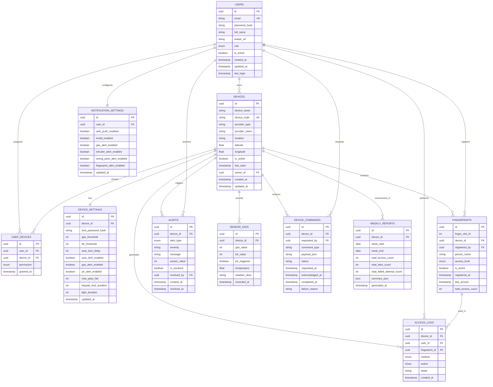
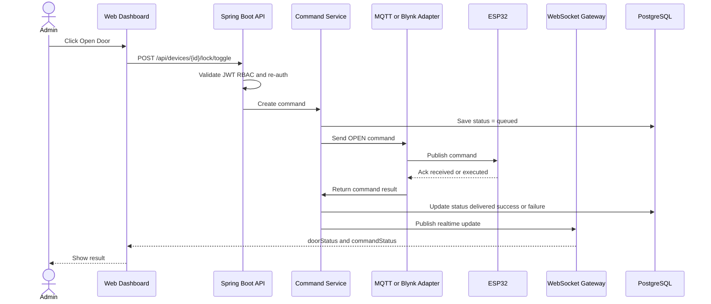

# Smart Lock IoT Web Dashboard

## Software Requirements Specification v2.0

## 1. Introduction

### 1.1 Purpose

This document defines the software requirements for the `Smart Lock IoT Web Dashboard`, a web-based system used to monitor, control, and manage a smart lock solution built on `ESP32` with `Blynk` or `MQTT` integration.

The platform extends the current embedded system by providing a richer web interface for:

- realtime monitoring
- remote control
- user and device management
- fingerprint management
- access logs and alert history
- analytics and reporting

### 1.2 Scope

The system supports:

- realtime monitoring of door status and sensor values
- remote door control with secure confirmation
- user authentication and role-based access control
- fingerprint record management
- access log and alert tracking
- device settings management
- weekly reports and operational analytics
- future multi-device support

### 1.3 Intended Users

- `Admin`: full control over devices, users, settings, fingerprint records, alerts, and reports
- `Member`: limited control over assigned devices and access to relevant logs and status
- `Viewer`: read-only visibility for assigned devices and logs
- `ESP32 Device`: system actor that sends telemetry and receives commands

### 1.4 Project Goals

- provide a more usable and complete management experience than the default IoT app
- centralize monitoring, control, and security events in one dashboard
- improve safety and auditability of door access and sensor alerts
- create a maintainable platform that can scale to multiple devices

## 2. Overall Description

### 2.1 Product Perspective

The web dashboard operates as the software control layer above the existing smart lock hardware.  
It communicates with the device through an IoT integration layer such as `Blynk` or `MQTT`, and stores operational data in a central backend database.

### 2.2 Product Functions

Main product functions include:

- user login and role-based authorization
- realtime dashboard for door state and sensor data
- remote open and close control
- fingerprint enrollment and deletion workflows
- access log and alert history
- settings configuration for thresholds and automation
- analytics and weekly reports

### 2.3 Operating Environment

- Frontend: `Next.js`
- Backend: `Spring Boot`
- Database: `PostgreSQL`
- Realtime transport: `WebSocket`
- Migration tool: `Flyway`
- IoT integration: `Blynk adapter` or `MQTT adapter`

### 2.4 Constraints

- must support secure authentication and permission control
- must maintain an audit trail for sensitive actions
- must work with ESP32-based smart lock devices
- must support low-latency state updates for core dashboard functions

## 3. Functional Requirements

### 3.1 Authentication and Authorization

- Users shall be able to log in with email and password.
- The system shall support role-based authorization with roles:
  - `Admin`
  - `Member`
  - `Viewer`
- The system shall require re-authentication for sensitive actions such as:
  - remote unlock
  - fingerprint deletion
  - system reset
  - lock password change

### 3.2 Dashboard Monitoring

- The dashboard shall display current door state in realtime.
- The dashboard shall display current sensor values:
  - gas
  - PIR
  - LDR
  - temperature
  - weather description
- The dashboard shall display device health indicators:
  - online or offline
  - last seen
  - system status
- The dashboard shall show active alerts through visible banners or toasts.

### 3.3 Remote Control

- Authorized users shall be able to open or close a door remotely.
- The system shall confirm sensitive control actions before execution.
- The system shall support auto-lock configuration.
- The system shall allow gas alert and PIR alert toggles.
- The system shall log all remote control actions.

### 3.4 Fingerprint Management

- The system shall display a list of enrolled fingerprints.
- The system shall allow administrators to enroll a fingerprint.
- The system shall allow administrators to delete a fingerprint.
- The system shall allow administrators to rename a fingerprint record.
- The system shall track metadata for each fingerprint:
  - slot ID
  - person name
  - registered by
  - last access
  - total access count

### 3.5 Access Logs and Alerts

- The system shall record access events.
- The system shall record alert events.
- The system shall support filtering logs by:
  - date
  - event type
  - device
  - user
- The system shall support exporting logs to CSV.

### 3.6 Settings Management

- The system shall support changing lock password settings.
- The system shall support gas threshold configuration.
- The system shall support LDR threshold configuration.
- The system shall support auto-lock delay configuration.
- The system shall support keypad lockout configuration.
- The system shall support device-level settings updates.

### 3.7 Analytics and Reports

- The system shall provide weekly operational summaries.
- The system shall provide access statistics.
- The system shall provide alert summaries.
- The system shall support future analytics such as:
  - gas trend chart
  - access heatmap
  - security incident report

## 4. Non-Functional Requirements

- Dashboard initial load should be under 2 seconds in normal conditions.
- Realtime dashboard updates should target latency below 500ms.
- The system shall enforce secure authentication and password storage.
- The system shall support responsive layouts for desktop, tablet, and mobile.
- The system shall maintain operational auditability for sensitive actions.
- The system shall be designed to support at least 10 devices per account.

## 5. Recommended Technical Architecture

- Frontend: `Next.js`
- Backend: `Spring Boot`
- Database: `PostgreSQL`
- Schema management: `Flyway`
- Realtime: `WebSocket`
- IoT integration: `MQTT` or `Blynk adapter`

Recommended backend style:

- `Modular Monolith`
- `Layered Architecture`
- `Controller -> Service -> Repository`
- event-driven realtime handling for device events and command acknowledgement

## 6. Use Case UML

```mermaid
flowchart TB
    Admin["Admin"]
    Member["Member"]
    Viewer["Viewer"]
    Device["ESP32 Device"]

    UC1["Login"]
    UC2["View realtime dashboard"]
    UC3["View door status"]
    UC4["View sensor data"]
    UC5["Remote open or close door"]
    UC6["Configure auto-lock"]
    UC7["Configure alerts"]
    UC8["Manage fingerprints"]
    UC9["View access logs"]
    UC10["View alert history"]
    UC11["Filter and export logs"]
    UC12["Manage users and roles"]
    UC13["Configure system settings"]
    UC14["View analytics and reports"]
    UC15["Send sensor data"]
    UC16["Send alert event"]
    UC17["Send access event"]
    UC18["Receive control command"]

    Admin --> UC1
    Admin --> UC2
    Admin --> UC3
    Admin --> UC4
    Admin --> UC5
    Admin --> UC6
    Admin --> UC7
    Admin --> UC8
    Admin --> UC9
    Admin --> UC10
    Admin --> UC11
    Admin --> UC12
    Admin --> UC13
    Admin --> UC14

    Member --> UC1
    Member --> UC2
    Member --> UC3
    Member --> UC4
    Member --> UC5
    Member --> UC6
    Member --> UC9
    Member --> UC10

    Viewer --> UC1
    Viewer --> UC2
    Viewer --> UC3
    Viewer --> UC4
    Viewer --> UC9

    Device --> UC15
    Device --> UC16
    Device --> UC17
    Device --> UC18
```

## 7. Core Use Case List

1. User logs into the system.
2. Admin views realtime dashboard data.
3. Admin sends a remote unlock command.
4. Backend validates role and command safety.
5. Device receives the command and returns execution status.
6. System updates dashboard state in realtime.
7. Admin manages fingerprint records.
8. System stores access and alert events.
9. Users review logs, alerts, and analytics.
10. Admin updates system settings.

## 8. ERD

## 9. Entity Descriptions

- `USERS`: system users and roles
- `DEVICES`: smart lock devices
- `USER_DEVICES`: permission mapping between users and devices
- `DEVICE_SETTINGS`: per-device configurable parameters
- `FINGERPRINTS`: enrolled fingerprint records
- `ACCESS_LOGS`: access history and security events
- `ALERTS`: alert history and resolution status
- `SENSOR_DATA`: telemetry and sensor readings
- `DEVICE_COMMANDS`: command lifecycle and acknowledgement tracking
- `NOTIFICATION_SETTINGS`: user notification preferences
- `WEEKLY_REPORTS`: generated weekly summary data

## 10. Remote Unlock Sequence

## 11. Recommended Backend Structure

The project is best implemented using:

- `Modular Monolith`
- `Layered Architecture`
- `Spring Boot`
- `PostgreSQL`
- `Flyway`
- `WebSocket`

Recommended module groups:

- auth
- users
- devices
- commands
- alerts
- accesslog
- fingerprints
- settings
- analytics
- realtime
- integration

## 12. Conclusion

This SRS defines a complete and scalable foundation for the Smart Lock IoT Web Dashboard.  
It is suitable for implementation with:

- `Next.js` on the frontend
- `Spring Boot` on the backend
- `PostgreSQL + Flyway` for data management
- `WebSocket + MQTT/Blynk adapter` for realtime device integration
